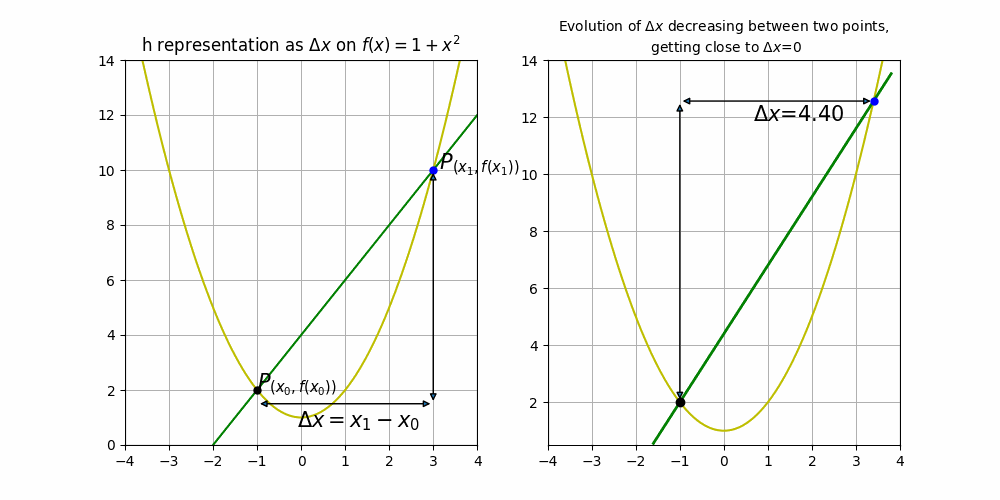
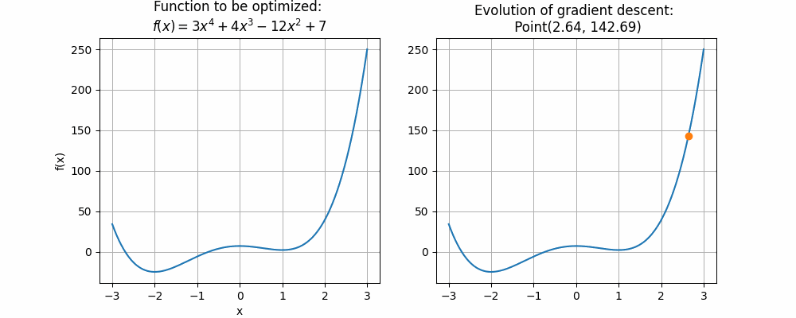
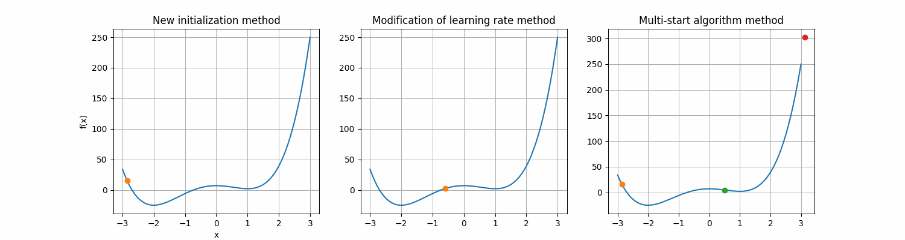
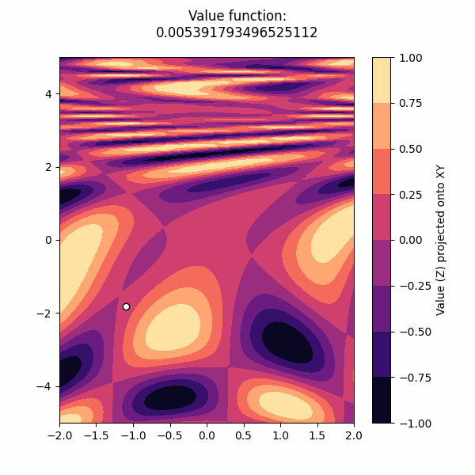

# Implementing Gradient Descent by hand 
An intuitive view of gradient descent and derivative concept.

**Gradient descent** is an optimization algorithm used in machine learning and mathematical optimization. It's a method for finding the minimum of a function by iteratively adjusting the parameters in the direction of the steepest descent of the function. The goal is to reach the local or global minimum of the function by taking steps proportional to the negative of the gradient of the function at the current point. This process is repeated iteratively until a convergence criterion is met. Gradient descent is a fundamental technique used in training machine learning models, particularly in tasks like training neural networks.

In this repository, we'll get closer to this concept through the geometric representation of some mathematical concepts, so that we can follow the behavior of gradient descent through some cool animations:

1. **Derivative**

 .  The principal concept underlying gradient descent implementation. **Derivative definition** is a local concept, calculated between an interval (between two points) in which the function is continuous (two input values $x_{1}$ and $x_{2}$, where $h=x_{2}-x_{1}$), and represented as the limit of that same interval when it gets down to 0, we usually found it as:

$$ f´(x)=\lim_{h \to 0}\frac{f(x_{1}+h)-f(x_{1})}{h}$$

 2. **Gradient**

  .The gradient, on the other hand, represents a generalization of the derivative for functions that depend on more than one variable (in the case of a single-variable function, the gradient is simply the derivative of that function). The gradient is a vector that points in the direction of the maximum rate of change of the function at a given point, and its magnitude indicates the maximum rate of change in that direction. The components of the gradient indicate how the function changes in each of the directions (axes) of the variables, then the gradient of $f$ can be formed, which is a vector containing all the partial derivatives of $f$ with respect to each variable. It is denoted as: $$\nabla f = \left(\frac{{\partial f}}{{\partial x_1}}, \frac{{\partial f}}{{\partial x_2}}, \ldots, \frac{{\partial f}}{{\partial x_n}}\right)$$

  Therefore, while the derivative refers to the instantaneous rate of change of a function at a specific point, the gradient refers to the direction and magnitude of the maximum rate of change of a function at a point in the space of multiple variables.

But, How does gradient descent help us find local or global minimum/s on a funtion? Follow the notebook to get a detailed and simple explanation on the concept while contructing your gradient descent algorithm in python!

Here are some cool animations on simple and multivariable functions:

### Simple implementation over non-multivariate function:

### Playing around with the main components of gradient descent:
The result of playing with the basic elements of gradient descent in ML applications:

1. **Objective Function (Cost or Loss Function)**:
The function that needs to be minimized. It represents the problem you are trying to solve or optimize. 

2. **Gradient**:
The gradient is the vector of partial derivatives of the objective function with respect to each parameter. It indicates the direction of steepest ascent. In mathematical notation, the gradient is denoted as ∇f(x).

3. **Learning Rate**:
The learning rate (also known as step size) determines the size of the steps taken in the direction of the gradient during each iteration. It is a hyperparameter that needs to be set appropriately. Too large a learning rate may lead to overshooting, and too small a learning rate may result in slow convergence.

4. **Update Rule**:
The formula used to update the parameters based on the gradient and the learning rate. It adjusts the parameters in the direction that reduces the value of the objective function.

5. **Convergence Criteria (or tolerance)**:
A stopping condition that determines when the optimization process should stop. This can be based on a maximum number of iterations, a certain level of tolerance, or other conditions.

6. **Iteration**:
The process of repeatedly updating the parameters using the update rule. Each iteration aims to move the parameters closer to the optimal values.

7. **Initial Guess (Starting Point)**:
The initial values assigned to the parameters before starting the optimization process. The optimization algorithm iteratively updates these values to reach the optimal solution.

### Application of gradient descent over multivariate functions:

